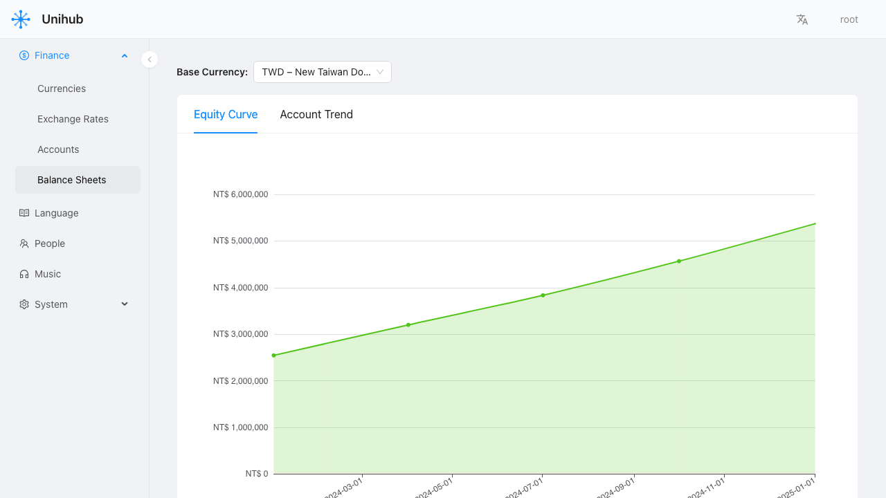
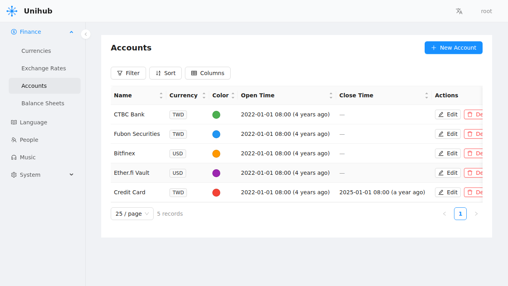
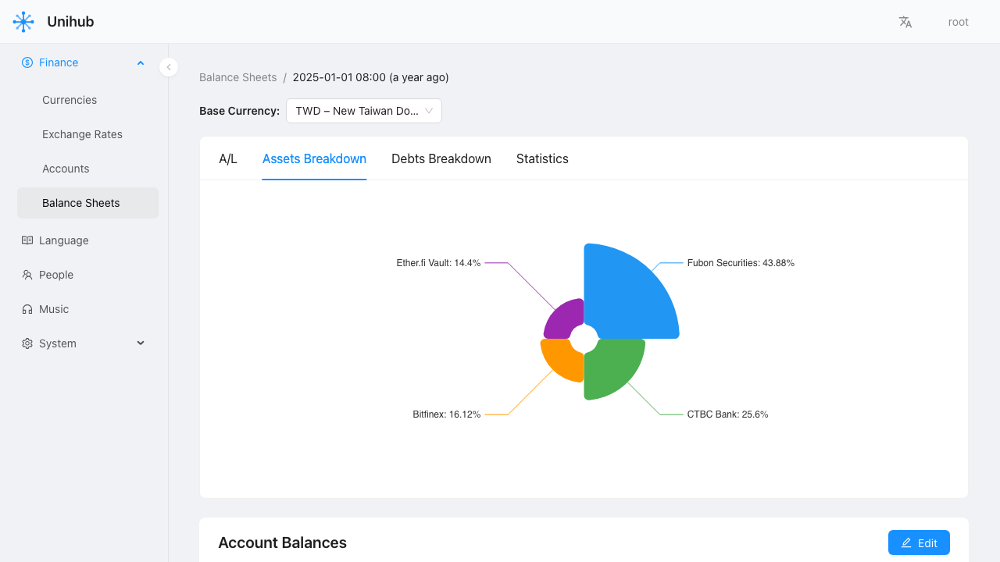

<div align="center">
  
  <h1>UniHub</h1>
  <p><em>Your personal life OS — one dashboard to capture, organise, and browse everything that matters.</em></p>

  [](https://github.com/gocreating/unihub/actions/workflows/ci.yml)
  [](https://github.com/gocreating/unihub/releases)
  [](LICENSE)
</div>

---

## What is UniHub?

Most productivity tools solve one problem. UniHub brings all of them under one roof.

Add a new area of your life — finance, vocabulary, places, people — and it appears in the same familiar dashboard. No app-switching, no data scattered across five different services. As new areas of your life become worth tracking, a new domain is connected to the hub.

## Domains

| Domain | What it tracks |
|--------|----------------|
| **Finance** | Accounts, balances, exchange rates, and net worth over time |
| **Visiting** | Places you've been and want to visit next |
| **Language** | Vocabulary cards and grammar sheets for languages you're learning |
| **People** | Personal contacts and relationship network |
| **Music** | Your song collection |
| More... | New domains are added over time — the interface stays the same |

## Screenshots

<div align="center">
  
  <p><em>Finance — track net worth and equity growth over time</em></p>
</div>

<div align="center">
  
  <p><em>Finance — manage accounts across currencies with rich filtering and sorting</em></p>
</div>

<div align="center">
  
  <p><em>Finance — visualise asset allocation by account at any point in time</em></p>
</div>

## Getting Started

### Prerequisites

- [Docker](https://docs.docker.com/get-docker/) and Docker Compose v2+
- Git

No other tooling needed — Docker handles the rest.

### Run Locally

```bash
git clone https://github.com/gocreating/unihub.git
cd unihub
docker compose -f apps/unihub/docker-compose.local.yml up
```

Once running:

- **App** → [http://localhost:3001](http://localhost:3001)
- **API docs** → [http://localhost:8001/api/docs/](http://localhost:8001/api/docs/)

Default login: username `root`, password `root`.

### Troubleshooting

- **Port already in use**: Edit the port mappings in `apps/unihub/docker-compose.local.yml`.
- **Services not starting**: Ensure Docker has at least 2 GB of memory available (Docker Desktop → Settings → Resources).

## Contributing

Pull requests are welcome. For significant changes, open an issue first to discuss what you'd like to change.

## License

[MIT](LICENSE)
